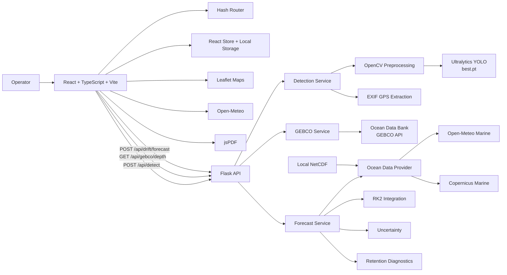
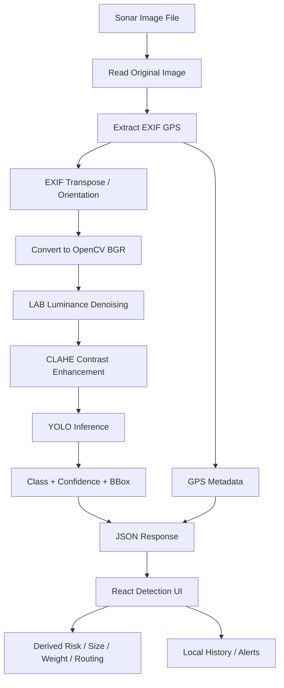
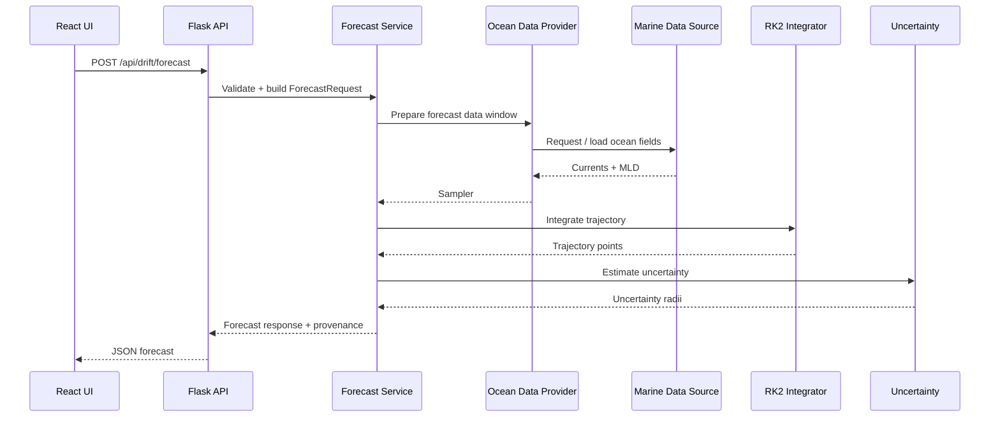
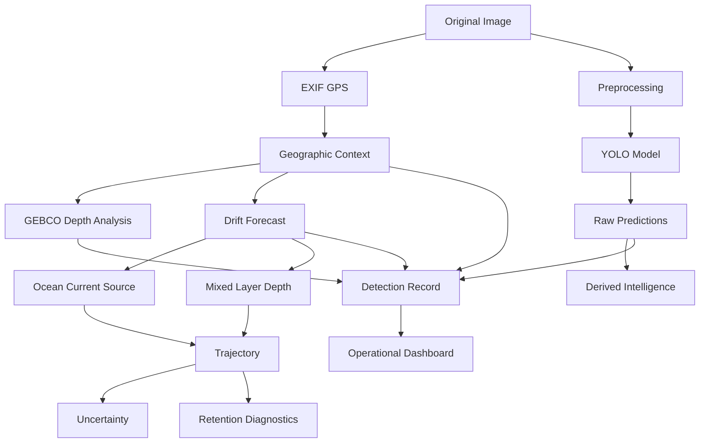
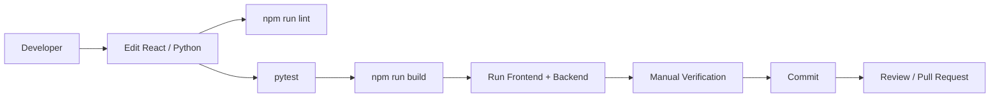

# ANVESHA — Marine Intelligence & Underwater Object Analysis

<p align="center">
  
</p>

<p align="center">
  <strong>AI-assisted marine object detection, geospatial analysis, bathymetry and drift forecasting.</strong>
</p>

<p align="center">
  <a href="https://github.com/Bhavikvishe/newdemo">Repository</a>
  ·
  <a href="#installation">Installation</a>
  ·
  <a href="#api-reference">API Reference</a>
  ·
  <a href="#project-structure">Project Structure</a>
</p>

---

## Overview

**ANVESHA** is a full-stack web application for analysing underwater / sonar imagery and turning model detections into operationally useful marine intelligence.

The repository combines:

- a **React + TypeScript + Vite** web application,
- a **Flask** backend,
- **Ultralytics YOLO** inference,
- **OpenCV** sonar-image preprocessing,
- **EXIF GPS extraction** from the original image,
- **GEBCO bathymetry** retrieval through the Ocean Data Bank GEBCO API,
- **marine/weather data** retrieval from Open-Meteo,
- an optional **Copernicus Marine** data path,
- a physics-based **RK2 drift forecast** for detected floating/drifting objects,
- local persistence for application state and cached images,
- reporting/export functionality in the UI.

The current repository is primarily an application/prototype codebase: the frontend contains both real backend-connected flows and locally generated/mock operational data used to populate dashboard scenarios and UI states.

> **Important:** The model weights file (`best.pt`) is not included in the repository tree. The detection server expects a compatible Ultralytics `.pt` weights file to be available locally or specified with `ANVESHA_WEIGHTS`.

---

## Key Capabilities

### 1. Real sonar object detection

The Detection page sends image bytes to:

```text
POST /api/detect
```

The backend:

1. reads the original image,
2. extracts GPS coordinates from EXIF metadata,
3. corrects image orientation,
4. converts the image for OpenCV processing,
5. applies luminance denoising and CLAHE contrast enhancement,
6. runs Ultralytics YOLO inference,
7. returns the raw predictions, bounding boxes and optional debug information.

The frontend preserves the model's returned confidence value and displays all detections found above the selected confidence threshold.

### 2. Six trained object classes

The current UI is configured around these classes:

```text
shipwreck
pipeline
ghost_fishing_gear
cylinder
airplane
mine
```

The frontend maps model labels into its internal detection taxonomy through `src/lib/detect.ts`, while class metadata and operational recommendations live in the shared application data modules.

### 3. GPS-aware detection

GPS is taken from the image's **original EXIF metadata** before preprocessing.

The application does not derive geographic coordinates from a YOLO bounding box.

If an image contains no usable GPS coordinates, the real detection workflow reports an error instead of inventing a location.

### 4. Bathymetry / depth analysis

The frontend calls:

```text
GET /api/gebco/depth
```

The Flask backend queries the Ocean Data Bank GEBCO API.

The response contains:

- target-coordinate bathymetry,
- a transect,
- a local grid,
- derived water/pressure-related values used by the UI,
- provenance metadata.

The backend also contains an explicit synthetic fallback model for situations where live GEBCO data is unavailable. Responses identify that fallback as synthetic rather than presenting it as measured GEBCO data.

### 5. Drift forecasting

The backend exposes:

```text
POST /api/drift/forecast
```

The forecasting service combines:

- a validated forecast request,
- ocean-current samples,
- mixed-layer-depth information,
- a selectable marine data source,
- a two-stage Runge–Kutta (**RK2**) integrator,
- trajectory milestones,
- uncertainty radius calculation,
- retention-index diagnostics,
- provenance/source information.

Supported source values include:

```text
auto
local
copernicus
open_meteo
```

### 6. Marine weather / operational planning

The frontend can query Open-Meteo marine and weather endpoints and converts the returned conditions into operational labels such as:

```text
GOOD
CAUTION
POOR
```

The code also contains planning helpers that evaluate weather windows against case deadlines and risk level.

### 7. Operational case management

The UI includes pages and state handling for:

- detections,
- alerts,
- history,
- department routing,
- interdepartmental assistance,
- equipment requests,
- notes,
- escalation,
- verification,
- resolution,
- settings,
- system administration.

Application state is coordinated through the React store in `src/lib/store.tsx`.

### 8. Multi-language UI

The frontend includes dictionaries for:

- English (`en`)
- Hindi (`hi`)
- Marathi (`mr`)

See `src/lib/i18n.ts`.

### 9. Reports and cached images

The frontend includes image caching and report/export functionality using browser storage facilities and `jsPDF`.

---

# Architecture

## High-level architecture



## Detection workflow



## Drift forecast workflow



## Data / provenance model



---

# Technology Stack

## Frontend

| Technology | Purpose |
|---|---|
| React | UI and component system |
| TypeScript | Static typing |
| Vite | Development server and production bundling |
| Leaflet | Interactive maps |
| jsPDF | Client-side report/PDF generation |
| Tailwind CSS | Build-time styling integration |
| Oxlint | Linting |
| Browser Local Storage | Application state persistence |
| IndexedDB | Detection image cache |

## Backend

| Technology | Purpose |
|---|---|
| Python | Backend and scientific/data-processing layer |
| Flask | REST API server |
| Flask-CORS | Cross-origin access from the frontend |
| Ultralytics | YOLO inference |
| OpenCV | Sonar image preprocessing |
| Pillow | Image loading, orientation and EXIF |
| NumPy | Numerical operations |
| SciPy | Scientific/numerical support |
| xarray | NetCDF/ocean-data handling |
| netCDF4 | NetCDF access |
| Dask | Array/data processing support |
| Copernicus Marine | Optional marine data source |
| Pytest | Automated backend tests |

## External data/services

- Ocean Data Bank GEBCO API
- Open-Meteo Marine API
- Open-Meteo Weather API
- Copernicus Marine datasets (optional)
- Leaflet map tiles/services configured by the frontend

---

# Prerequisites

Install the following before running the project:

- **Node.js + npm**
- **Python 3**
- **Git**
- A compatible **Ultralytics YOLO `.pt` model weights file**
- Internet access for live GEBCO/Open-Meteo/Copernicus requests as applicable

A Python virtual environment is strongly recommended.

---

# Installation

## 1. Clone the repository

```bash
git clone https://github.com/Bhavikvishe/newdemo.git
cd newdemo
```

## 2. Install frontend dependencies

```bash
npm install
```

## 3. Create and activate a Python virtual environment

### Windows PowerShell

```powershell
python -m venv .venv
.venv\Scripts\Activate.ps1
```

### Windows CMD

```cmd
python -m venv .venv
.venv\Scripts\activate
```

### Linux / macOS

```bash
python3 -m venv .venv
source .venv/bin/activate
```

## 4. Install backend dependencies

```bash
pip install -r server/requirements.txt
```

## 5. Provide the YOLO weights

The backend searches for:

```text
best.pt
```

in either:

```text
<project-root>/best.pt
<project-root>/server/best.pt
```

You can also specify an absolute path with:

```text
ANVESHA_WEIGHTS
```

### Windows PowerShell example

```powershell
$env:ANVESHA_WEIGHTS="E:\models\best.pt"
```

### Linux / macOS example

```bash
export ANVESHA_WEIGHTS="/absolute/path/to/best.pt"
```

---

# Configuration

The detection backend supports these environment variables:

| Variable | Default | Description |
|---|---:|---|
| `ANVESHA_WEIGHTS` | auto-detect `best.pt` | Path to YOLO weights |
| `ANVESHA_CONFIDENCE` | `0.25` | Default YOLO confidence threshold |
| `ANVESHA_IOU` | `0.70` | Default IoU threshold |
| `ANVESHA_IMAGE_SIZE` | `640` | Default YOLO inference image size |
| `ANVESHA_DEBUG_DETECTION` | `false` | Enable extra detection debug output |
| `ANVESHA_GEBCO_URL` | ODB GEBCO API | Override GEBCO backend URL |

Additional forecasting configuration is read by the ocean-data layer. The code supports environment variables for Open-Meteo caching and Copernicus configuration, including:

```text
OPEN_METEO_CACHE_DIR
COPERNICUS_CACHE_DIR
COPERNICUS_ENABLED
COPERNICUSMARINE_SERVICE_USERNAME
COPERNICUSMARINE_SERVICE_PASSWORD
COPERNICUS_DATASET_ID
COPERNICUS_MLD_DATASET_ID
COPERNICUS_SPATIAL_MARGIN_DEGREES
COPERNICUS_CURRENT_TIME_TOLERANCE_HOURS
COPERNICUS_MLD_TIME_TOLERANCE_HOURS
```

Copernicus credentials should be supplied through environment variables rather than committed to the repository.

---

# Running the Application

The project is a two-process application: the Vite frontend and Flask API should be running at the same time during local development.

## Terminal 1 — start the Flask backend

From the repository root:

```bash
python server/app.py
```

The backend listens on:

```text
http://127.0.0.1:5000
```

Flask is configured to bind to:

```text
0.0.0.0:5000
```

when started directly.

## Terminal 2 — start the Vite frontend

```bash
npm run dev
```

Vite will print the local frontend URL in the terminal, commonly:

```text
http://localhost:5173
```

Open that URL in a browser.

---

# Frontend Scripts

The `package.json` currently defines:

```bash
npm run dev
npm run build
npm run lint
npm run preview
```

### Development

```bash
npm run dev
```

### Production build

```bash
npm run build
```

### Lint

```bash
npm run lint
```

### Preview a production build

```bash
npm run preview
```

---

# Backend API Reference

## `GET /api/health`

Checks whether the model can be loaded and returns model information.

### Example

```bash
curl http://127.0.0.1:5000/api/health
```

A successful response contains fields such as:

```json
{
  "ok": true,
  "weights_path": "...",
  "task": "detect",
  "classes": {
    "0": "..."
  },
  "default_conf": 0.25,
  "default_iou": 0.7,
  "default_imgsz": 640
}
```

The actual class mapping is taken from the loaded model.

---

## `POST /api/detect`

Runs sonar object detection.

### Request

The endpoint expects the **raw image bytes** in the request body.

Optional query parameters:

| Parameter | Type | Meaning |
|---|---|---|
| `conf` | float | Detection confidence threshold |
| `iou` | float | IoU threshold |
| `imgsz` | int | YOLO inference image size |
| `debug` | boolean-like | Include debug information |

### Example

```bash
curl -X POST \
  -H "Content-Type: image/jpeg" \
  --data-binary "@server/sonar_geotagged_test.jpg" \
  "http://127.0.0.1:5000/api/detect?conf=0.25&debug=true"
```

### Response shape

The exact response is generated by `server/model.py`, and includes the model prediction data plus GPS/debug metadata where available.

The frontend consumes:

```text
predictions
gps
debug
```

and preserves model confidence/bounding-box values as returned.

---

## `GET /api/gebco/depth`

Retrieves bathymetric information around a target coordinate.

### Query parameters

| Parameter | Default | Description |
|---|---:|---|
| `lat` | `18.90` | Latitude |
| `lng` | `72.70` | Longitude |
| `samples` | `21` | Transect sample count |
| `grid` | `5` | Grid size |
| `span_km` | `1.2` | Local span in kilometres |

The backend clamps these values to safe ranges before querying.

### Example

```bash
curl "http://127.0.0.1:5000/api/gebco/depth?lat=18.90&lng=72.70&samples=21&grid=5&span_km=1.2"
```

---

## `POST /api/drift/forecast`

Creates a physics-based drift forecast.

### Request body

```json
{
  "latitude": 18.9,
  "longitude": 72.7,
  "horizon_hours": 72,
  "timestep_minutes": 60,
  "source": "auto",
  "grid_margin_degrees": 5.0,
  "vector_grid_size": 5,
  "start_time": "2026-09-27T12:00:00Z"
}
```

### Main request fields

| Field | Required | Description |
|---|---|---|
| `latitude` | yes | Starting latitude |
| `longitude` | yes | Starting longitude |
| `horizon_hours` | no | Forecast horizon; defaults to `72` |
| `timestep_minutes` | no | Simulation step; defaults to `60` |
| `source` | no | `auto`, `local`, `copernicus`, or `open_meteo` |
| `grid_margin_degrees` | no | Spatial margin for vector data |
| `vector_grid_size` | no | Forecast vector grid size |
| `start_time` | no | ISO-8601 forecast start time |

The backend validates coordinates, source selection and timestamp format before starting the forecast.

---

# Detection Model Pipeline Details

The backend deliberately separates **model output** from **derived application intelligence**.

## Model output

These values come directly from YOLO:

```text
class label
confidence
normalized bounding box
pixel bounding box
```

## Derived intelligence

The frontend then calculates or selects operational metadata such as:

```text
estimated size
estimated weight
risk level
risk score
priority
response deadline
responsible department
recommended equipment
removal method
```

This distinction is visible in the Detection UI and is useful when debugging or evaluating the model because derived fields should not be mistaken for raw neural-network outputs.

---

# Real Data vs Synthetic Data

The repository contains both live-data integrations and synthetic/local application scenarios.

### Real / external

- YOLO model inference using `best.pt`
- EXIF GPS extraction from uploaded images
- GEBCO API bathymetry
- Open-Meteo marine/weather requests
- Copernicus Marine subsets when configured and enabled

### Local / synthetic

The frontend contains extensive mock operational data in `src/lib/mock.ts` and related application modules. This is used for:

- dashboard population,
- demonstrations,
- alerts,
- historical cases,
- operational scenarios,
- UI development.

There is also a server-side synthetic bathymetry fallback in `server/gebco.py` that is explicitly marked as synthetic when the live GEBCO service cannot be used.

When evaluating results scientifically, distinguish these paths from live external data.

---

# Project Structure

```text
newdemo/
├── public/
│   ├── anvesha-logo.png
│   ├── favicon.svg
│   └── icons.svg
│
├── server/
│   ├── app.py
│   ├── model.py
│   ├── image_preprocessing.py
│   ├── gebco.py
│   ├── validate_detection.py
│   ├── compare_confidence.py
│   ├── compare_preprocessing.py
│   ├── test_api.py
│   ├── test_cross_validation.py
│   ├── sonar_geotagged_test.jpg
│   ├── requirements.txt
│   │
│   ├── forecasting/
│   │   ├── __init__.py
│   │   ├── forecast_service.py
│   │   ├── models.py
│   │   ├── ocean_data.py
│   │   ├── retention.py
│   │   ├── rk2.py
│   │   ├── uncertainty.py
│   │   └── validation.py
│   │
│   └── tests/
│       ├── test_drift.py
│       ├── test_ocean_data.py
│       └── test_open_meteo_stencil.py
│
├── src/
│   ├── App.tsx
│   ├── App.css
│   ├── index.css
│   ├── main.tsx
│   │
│   ├── components/
│   │   ├── DriftForecastMap.tsx
│   │   ├── GeoMap.tsx
│   │   ├── Icons.tsx
│   │   ├── NavData.tsx
│   │   ├── Onboarding.tsx
│   │   ├── Shell.tsx
│   │   └── Weather.tsx
│   │
│   ├── lib/
│   │   ├── charts.tsx
│   │   ├── detect.ts
│   │   ├── drift.ts
│   │   ├── gebco.ts
│   │   ├── geo.ts
│   │   ├── i18n.ts
│   │   ├── labels.ts
│   │   ├── mock.ts
│   │   ├── router.tsx
│   │   ├── sonar.ts
│   │   ├── store.tsx
│   │   ├── ui.tsx
│   │   ├── weather.ts
│   │   │
│   │   └── x/
│   │       ├── admin.ts
│   │       ├── alerts.ts
│   │       ├── basehi.ts
│   │       ├── basemr.ts
│   │       ├── batch.ts
│   │       ├── charts.ts
│   │       ├── dashboard.ts
│   │       ├── departments.ts
│   │       ├── detail.ts
│   │       ├── detection.ts
│   │       ├── history.ts
│   │       ├── index.ts
│   │       ├── landing.ts
│   │       ├── login.ts
│   │       ├── map.ts
│   │       ├── mydept.ts
│   │       ├── onboarding.ts
│   │       ├── settings.ts
│   │       ├── shell.ts
│   │       ├── sonar.ts
│   │       ├── store.ts
│   │       ├── ui.ts
│   │       └── weather.ts
│   │
│   ├── pages/
│   │   ├── Admin.tsx
│   │   ├── Alerts.tsx
│   │   ├── Batch.tsx
│   │   ├── Dashboard.tsx
│   │   ├── Departments.tsx
│   │   ├── DepthAnalysis.tsx
│   │   ├── Detail.tsx
│   │   ├── Detection.tsx
│   │   ├── DriftForecast.tsx
│   │   ├── History.tsx
│   │   ├── Landing.tsx
│   │   ├── Login.tsx
│   │   ├── Map.tsx
│   │   ├── MyDepartment.tsx
│   │   ├── Settings.tsx
│   │   └── batchTypes.ts
│   │
│   ├── types/
│   │   └── index.ts
│   │
│   └── assets/
│       ├── hero.png
│       ├── react.svg
│       └── vite.svg
│
├── index.html
├── package.json
├── package-lock.json
├── vite.config.ts
├── tsconfig.json
├── tsconfig.app.json
├── tsconfig.node.json
├── .oxlintrc.json
└── .gitignore
```

---

# Frontend Routes

Routing is implemented with a custom hash-based router in `src/lib/router.tsx`.

The application currently exposes routes corresponding to:

| Route | Page |
|---|---|
| `landing` | Landing page |
| `login` | Login |
| `overview` | Dashboard |
| `detection` | Real AI detection |
| `batch` | Batch workflows |
| `depth` | GEBCO depth analysis |
| `map` | Marine map |
| `drift` | Drift forecast |
| `alerts` | Alerts |
| `history` | Detection/history view |
| `settings` | Application settings |
| `departments` | Department view |
| `department` | Current department |
| `admin` | System administration |
| `detail` | Detection/case detail |

The application redirects signed-out users to login for protected pages.

Administrator routing also performs a role check based on the `system-admin` department.

---

# Testing

## Backend tests

The repository includes Pytest-based tests for:

```text
server/tests/test_drift.py
server/tests/test_ocean_data.py
server/tests/test_open_meteo_stencil.py
server/test_api.py
server/test_cross_validation.py
```

Run the test suite from the repository root:

```bash
pytest
```

## Detection validation utilities

Additional scripts are included for model/preprocessing evaluation:

```bash
python server/validate_detection.py
python server/compare_confidence.py
python server/compare_preprocessing.py
```

These utilities are useful when comparing:

- baseline vs processed images,
- confidence changes,
- detection behaviour,
- model output formatting.

---

# Troubleshooting

## Backend cannot find `best.pt`

You may see an error indicating that trained weights could not be found.

Place the file at:

```text
./best.pt
```

or:

```text
./server/best.pt
```

or set:

```text
ANVESHA_WEIGHTS
```

to an absolute path.

---

## Frontend cannot reach the backend

Make sure both processes are running:

```text
Frontend: Vite
Backend:  Flask on port 5000
```

Start the backend with:

```bash
python server/app.py
```

Then run:

```bash
npm run dev
```

The detection client uses the `/api/detect` route, while the drift client currently uses the explicit local backend base URL:

```text
http://127.0.0.1:5000
```

---

## Detection says GPS metadata is missing

Real detection requires GPS metadata from the uploaded image.

The backend reads the original image's EXIF GPS fields.

Use a geotagged image containing valid:

```text
GPSLatitude
GPSLatitudeRef
GPSLongitude
GPSLongitudeRef
```

and retry the scan.

---

## GEBCO request fails

Check:

1. internet connectivity,
2. the GEBCO service availability,
3. latitude/longitude values,
4. backend logs.

When live GEBCO access fails, the backend can use its explicitly-labelled synthetic fallback.

---

## Copernicus forecast is unavailable

Copernicus is an optional data path.

Check:

```text
COPERNICUS_ENABLED
COPERNICUSMARINE_SERVICE_USERNAME
COPERNICUSMARINE_SERVICE_PASSWORD
```

and the dataset configuration.

For local development, `auto` may select another available source depending on the forecast/data configuration.

---

# Development Notes

## State persistence

The main React store persists application state in browser storage and can restore data across reloads.

Detection image data is separately cached using IndexedDB through:

```text
src/lib/detect.ts
```

## Mock data

The repository intentionally includes substantial generated/sample operational data in:

```text
src/lib/mock.ts
src/lib/x/*
```

Do not assume every dashboard record is produced by a live backend call.

## Client-side reports

The frontend uses `jsPDF` for report generation. Reports are generated in the browser rather than by a server-side PDF service.

---

# Security & Deployment Considerations

This repository is structured primarily for development/prototyping. Before production deployment, consider:

- authentication backed by a real identity system,
- secure password handling,
- HTTPS,
- server-side authorization,
- request-size limits for uploaded images,
- rate limiting,
- structured logging,
- secret management for Copernicus credentials,
- model-file integrity and controlled storage,
- strict CORS configuration,
- API schema validation,
- persistent server-side database/storage,
- background job processing for expensive forecasts/inference,
- production WSGI serving instead of Flask's development server,
- controlled map-tile/API usage,
- monitoring of third-party data-source failures.

---

# Limitations

The current codebase has some architectural characteristics worth knowing before treating it as a production platform:

1. **The repository does not contain `best.pt`.** Model inference therefore requires an external weights file.
2. **Application state is largely client-side.** The main store uses browser persistence rather than a dedicated database.
3. **There is extensive mock/demo data.** Some operational dashboards are populated locally.
4. **Third-party marine services can fail or vary in coverage.** GEBCO, Open-Meteo and Copernicus paths should be treated as external dependencies.
5. **The drift engine is physics/data based, not a learned trajectory model.** The repository uses RK2 integration plus uncertainty and retention calculations.
6. **Some derived estimates are application heuristics.** They are not direct measurements from the YOLO network.
7. **Production authentication/authorization is not equivalent to a full identity/security stack.** The current app implements application-level role handling.

---

# Suggested Development Workflow



---

# Contributing

A practical contribution flow is:

```bash
git checkout -b feature/your-feature
```

Make the change, then run:

```bash
npm run lint
npm run build
pytest
```

Commit the work:

```bash
git add .
git commit -m "feat: describe your change"
git push -u origin feature/your-feature
```

Then open a pull request.

When contributing to model/data functionality, clearly identify whether a change affects:

- raw model output,
- preprocessing,
- external data retrieval,
- derived heuristics,
- visualization,
- mock/demo data.

---

# Acknowledgements

This project integrates open-source tools and external data services including:

- React
- TypeScript
- Vite
- Leaflet
- Flask
- Ultralytics YOLO
- OpenCV
- Pillow
- NumPy / SciPy
- xarray / netCDF4 / Dask
- Copernicus Marine
- GEBCO / Ocean Data Bank
- Open-Meteo

Please review the respective licenses, attribution terms and usage policies before deploying the application publicly.

---

# Repository Status

This repository represents an actively developed application/prototype combining AI-based sonar detection with marine geospatial and forecasting workflows.

For the most accurate implementation details, use the source code in:

```text
server/
src/
package.json
server/requirements.txt
```

The README describes the code currently present in the repository and intentionally distinguishes real model/data paths from synthetic demo data.

---

## License

No `LICENSE` file is currently present in the repository. Add an explicit license before distributing the project under an open-source license.

---

## Repository

**GitHub:** https://github.com/Bhavikvishe/newdemo
